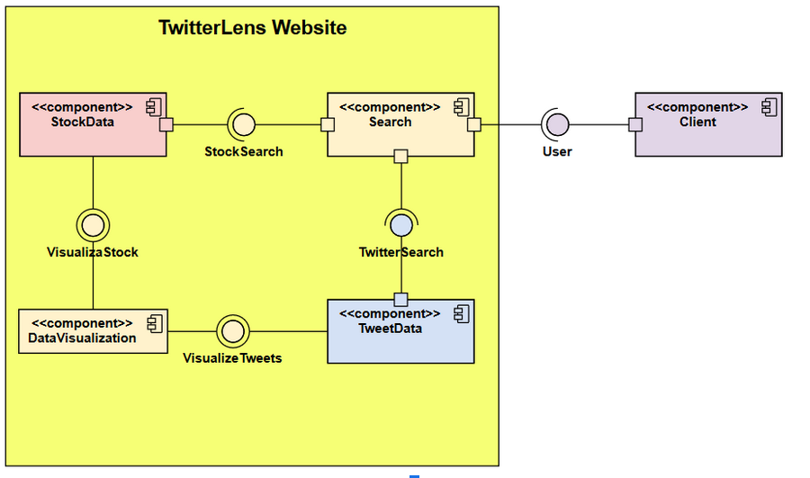
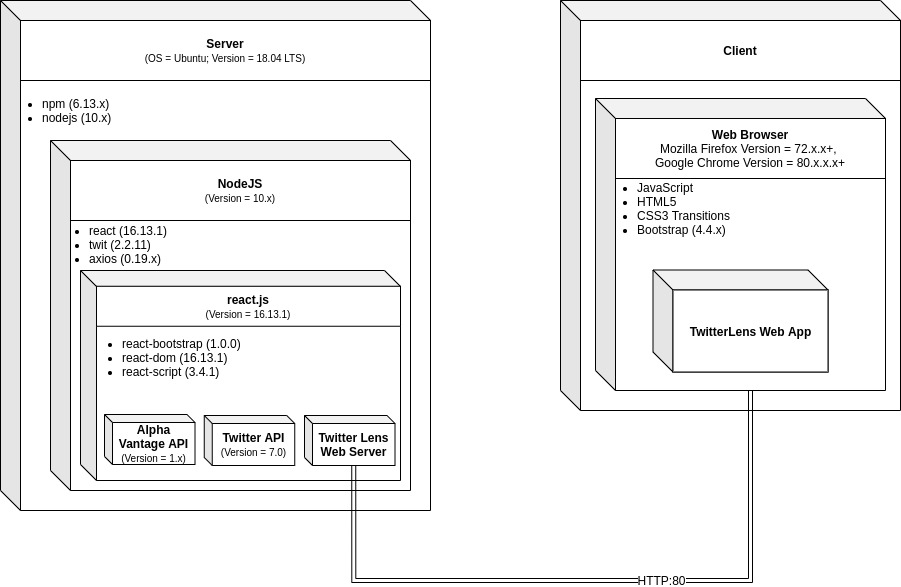

 

# Twitter Lens

## Viewing Twitter through a custom Lens

_A Git Push Git Paid Project: We are the masters of our craft_

__Contact:__ TwitterLensDev@gmail.com


# Our Vision

## Executive Summary 

TwitterLens is a tool that utilizes live stock market data in tandem with relevant Tweets 
from Twitter in order to inform investors and day traders of live market sentiment. TwitterLens will consist of a website similar to a search engine, where the user can search for a company to view related tweets and statistics. Users may apply filters to narrow down the search to specific categories, such as Tweets that were published by market analysts rather than the general customer, or vice versa. This tool will show the correlation between stock price and public sentiment, providing invaluable insight that goes beyond the news and price charts. 

## Features 

This project has a bunch of features that makes the project valuable. One key feature of 
TwitterLens is data visualization of a company’s Twitter buzz over a period of time. Another key feature of the project is that it compares the visualized Twitter buzz over a period of time for a company to the company’s stock prices over that same period of time. The project also makes use of a custom filter feature to filter out irrelevant data in searches.

## Business Case 

### Niche 

This project’s target audience is people who are investing in stocks and developers who 
are creating machine learning apps for investing. People who are new to investing in stocks need a nice, friendly place to start learning about companies. This project would be ideal to these people as it gives visualizations of a company’s Twitter buzz and the stock values over a set period of time. Developers who are creating machine learning apps for investing, need a way of collecting, cleaning, filtering, and using the data. TwitterLens would help these developers because it cleans, filters, stores, and visualizes crucial data which would reduce the amount of work they would need to put in to use the data. 

### Competition 

The Twitter advanced search function would be a competitor to this project. The Twitter 
advanced search allows you to search for posts between certain date ranges. Our project 
is better than this competitor because TwitterLens shows results for a company’s Twitter buzz and stock values over custom ranges, in addition to providing visualization for the data over the date range, and uses custom filters to filter out irrelevant data. Here is a link to the competition: https://twitter.com/ 

### Value for the Effort 

This project could be of great value to the community because it would allow people who 
are new to investing in stocks to look at visualized data about a given company to get an idea of which companies are doing well and which are not. The social impact from this could be that the project leads to more people getting involved in investing, which has great social value as it can positively affect peoples’ lives. This project can even be made into a product that will generate profit for the effort because it would be marketable to developers that are developing an investing app that uses machine learning. The way our project collects and manages the data would make it worth the investment, as it would make the developers’ lives easier.

### Risks of Product Success 

The product faces a couple barriers when it comes to selling the product. One barrier the 
product faces is that there is not a large number of developers who are developing investment apps so the demand for the app would not be very high. Another barrier is that developers may be looking for more data than what we would be storing, so they may not be as motivated to buy our product. 

## Stakeholders 

The stakeholders of this project are Professor John Sturman, Teaching Assistants Chau-Lin 
(Charley) Huang and Vaishnavi Neema, and team members Andrew Emanuel, Daniel Peladeau, Matthew Riina, Matthew Solomon, and Nicholas Nazario. Professor Sturman, Charley, and Vaishnavi have vested interest in our project because the success of the project is a direct reflection of their successful teaching. Professor Sturman has also noted that he lives to see his students be creative with their projects and succeed. The team members are stakeholders for this project because we are invested in the success of the project, as we want to bring our vision to life, to distribute our software to educate the community, and also it determines our grade in the class, which we have a vested interest in.


# Application Information

## Running Web App

The follwoing instructions can be used to run the web application

```bash
cd twitterlens
npm install
npm start
```

## Domain Model


## Deployment Structure

 


# Team Practices

## Coding Standards

### Python

The Twitter Lens Team follows the PEP8 coding standard for all Python scripts

### JavaScript

The Twitter Lens Team follows the ES6 coding standard for all JavaScript scripts


## Linters

The Twitter Lens Team makes use of the following linters to enforce our coding standards

### Python

The Twitter Lens Team used __pylint__ as a python linter to enforce PEP8 standards

### JavaScript

The Twitter Lens Team used __ESLint__ as a javascript linter to enforce ES6 standards

## Third Party Components

1. Bootstrap, a free and open-source style sheet, is used to style our componenets
2. AlphaVantage, a stock data API, is used by Twitter Lens to collect stock pricing
3. Twitter's developer API is used by Twitter Lens to collect, filter, and display tweets
4. React.js, a free and open-source web framework, is used by Twitter Lens as the framework for the web application


